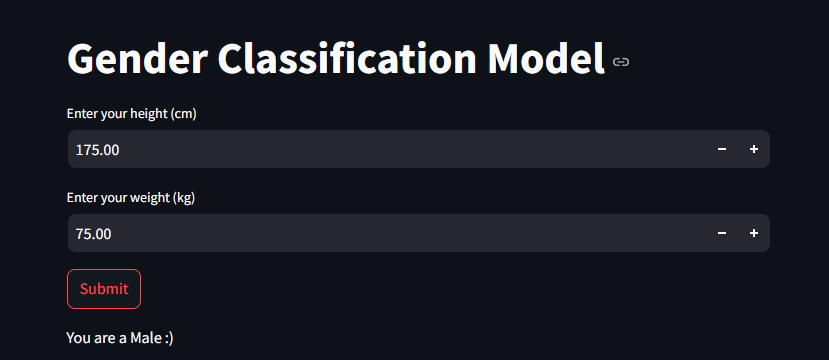
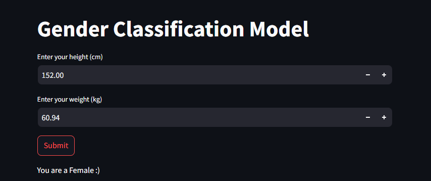

# Gender Classification

This project implements a gender classification model using supervised learning with a dataset that includes height (in cm) and weight (in kg) as features. The model is trained using a Support Vector Classifier (SVC), achieving an accuracy of 0.87. The trained model predicts gender based on the provided inputs and is saved using Joblib for easy reuse. The user interface is built with Streamlit, allowing users to input their height and weight through a simple web app, which then displays the predicted gender.

The project demonstrates basic machine learning techniques, including data preprocessing, model training, evaluation, and saving the model for future use. The SVC model is evaluated using accuracy, and the dataset is split into training and testing sets. Key Python libraries such as Pandas, Seaborn, Matplotlib, Scikit-learn (for model building and evaluation), Numpy, and Joblib are used.

Used Modules:
1.  pandas
2.  seaborn
3.  matplotlib
4.  scikit-learn
5.  numpy
6.  joblib
7.  streamlit

Steps to run:

1.  Set up a virtual environment (optional but recommended).
2.  Install the dependencies by running pip install -r requirements.txt.
3.  Run the Streamlit app with streamlit run Display.py.
4.  The app will open in your browser.

Results: 

